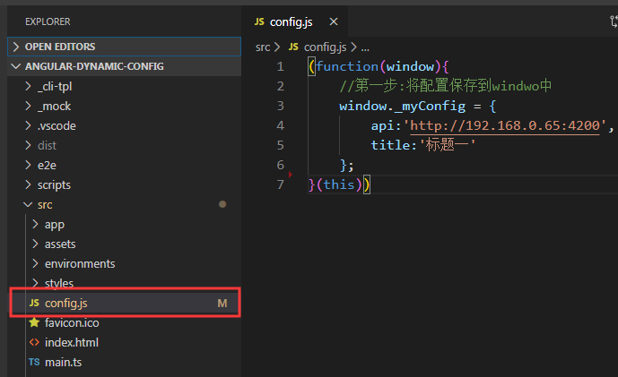
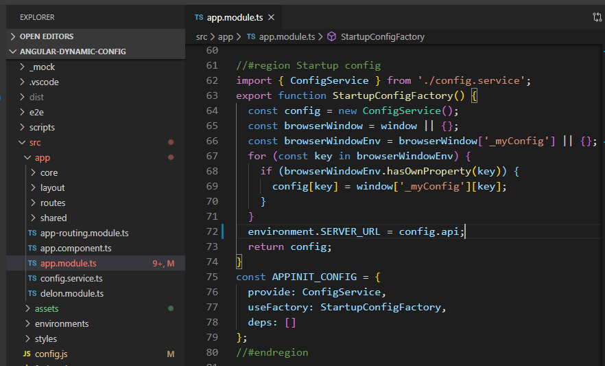

# 如何不需重新构建，使用环境变量来配置 Angular 应用
当一个项目需要发布到生产环境、开发环境和测试环境，之前只能通过修改或者添加多个接口配置，然后逐个编译。项目大了后编译一次就需要十来分钟，那样太痛苦了，于是去搜了下怎么在项目编译后修改相关配置的解决方案。

### 演示项目直接拿了alain来用
官网地址：https://ng-alain.com

### 外网大佬Jurgen Van de Moere的演示项目，我根据需求精简了
https://github.com/jvandemo/angular-environment-variables-demo

### 中文版原理解析，翻译的就是Jurgen Van de Moere的文章，里面有原文链接，这里就不贴了
http://www.ngbeijing.cn/2019/03/06/2019-3-6-how-to-use-environment-variables-to-configure-your-angular-application-without-a-rebuild/

### 操作步骤
- 第一步：新建一个配置文件.js，本文是将数据保存到window对象中。（不要让配置文件加入编译，可以直接把文件建在assets中，但是这样项目结构就有点混乱。所以示例中建在src下，然后在angular.json的assets里加上就可以不参与打包编译了。）
```javascript
(function(window){
    //第一步:将配置保存到window中
    window._myConfig = {
        api:'http://192.168.0.65:4200',
        title:'标题一'
    };
}(this))
```


- 第二步：在index.html的head引入该脚本，确保配置脚本在Angular之前加载。
```javascript
<script src="./config.js"></script>
```

- 第三步：
通过工厂函数在app.module注入初始化操作，因为代码较少，所以直接写在app.module里了。
```javascript
//#region Startup config
import { ConfigService } from './config.service';
export function StartupConfigFactory() {
   //用服务去接收window里存储配置，方便项目使用
  const config = new ConfigService();
  const browserWindow = window || {};
  const browserWindowEnv = browserWindow['_myConfig'] || {};
  for (const key in browserWindowEnv) {
    if (browserWindowEnv.hasOwnProperty(key)) {
      config[key] = window['_myConfig'][key];
    }
  }
  environment.SERVER_URL = config.api;
  return config;
}
//将APPINIT_CONFIG添加到providers里，这样Angular初始化的时候就会执行上面的代码
const APPINIT_CONFIG = {
  provide: ConfigService,
  useFactory: StartupConfigFactory,
  deps: []
};
//#endregion
```
